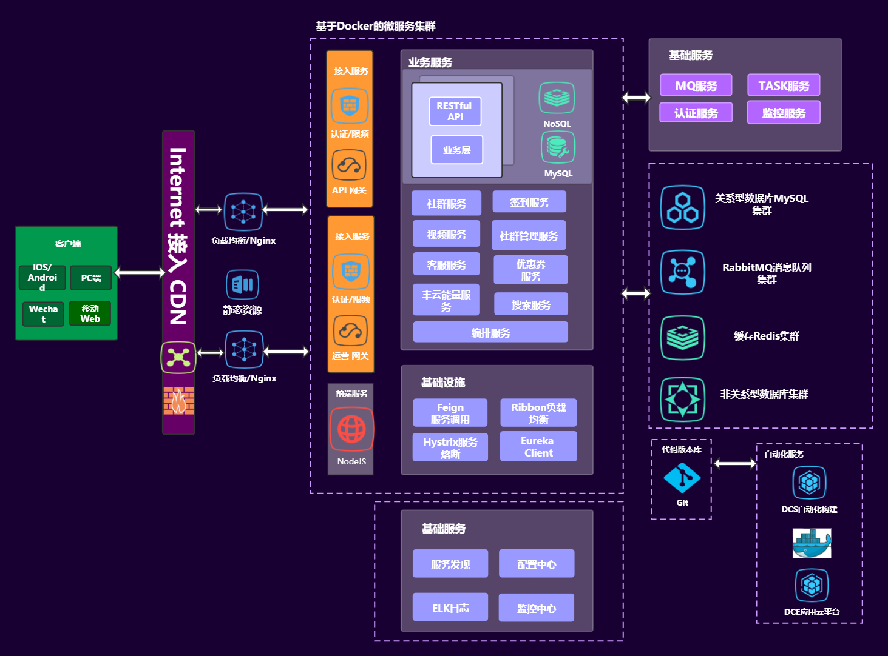

# paladin-doc
paladin工程的所有文档

#### 技术列表

| 技术                | 说明                                                         | 官网                                             |
| ------------------- | ------------------------------------------------------------ | ------------------------------------------------ |
| Java相关框架 |  |  |
| Spring Boot         | servlet容器和springMVC                                       | https://spring.io/projects/spring-boot/          |
| Spring Cloud        | 微服务管理                                                   | https://spring.io/cloud                          |
| Spring Security     | 认证和访问控制框架                                           | https://spring.io/projects/spring-security/      |
| mybatis             | ORM框架                                                      | https://mybatis.org/mybatis-3/zh/index.html      |
| mybatis-plus        | mybatis增强                                                  | https://baomidou.com/                            |
| Mybatis-PageHelper  | 物理分页插件                                                 | https://github.com/pagehelper/Mybatis-PageHelper |
| knife4j             | 接口文档生成工具，前身是swagger-bootstrap-ui                 | https://doc.xiaominfo.com/                       |
| Hibernate Validator | bean校验规范(JSR303、JSR354)的实现                           | http://hibernate.org/validator/                  |
| Elasticsearch       | Elastics Stack 的核心(ELK)                                   | https://www.elastic.co/cn/elasticsearch/         |
| RabbitMQ            | 消息中间件                                                   | https://www.rabbitmq.com/                        |
| Redis               | 数据库、缓存、消息中间件                                     | https://redis.io/                                |
| mongoDB             | 云时代通用的、基于文档的分布式数据库                         | https://www.mongodb.com/                         |
| Docker              | 帮助构建和部署应用                                           | https://www.docker.com/                          |
| kubernetes          | 生产级的容器编排工具，自动化容器部署、扩容和管理             | https://kubernetes.io/docs/home/                 |
| Druid               | 为监控而生的数据库连接池                                     | https://github.com/alibaba/druid/                |
| MySQL               | 关系型数据库                                                 | https://www.mysql.com/                           |
| JWT                 | JSON Web Tokens是开放的、工业级标准RFC7519方法，安全展示两个应用间的声明 | https://jwt.io/                                  |
| Jenkins             | 构建、部署和自动化工程                                       | https://www.jenkins.io/                          |
| nginx               | HTTP、反向代理、邮件代理和TCP/UDP代理服务器                  |                                                  |
| 前端框架 |  | |
| Vue        | 渐进式JavaScript框架                                     | https://cn.vuejs.org/                                        |
| Vue Router | Vue.js官方的路由管理器                                   | https://router.vuejs.org/zh/                                 |
| Vuex       | 状态管理模式                                             | https://vuex.vuejs.org/zh/                                   |
| Element    | 基于vue2.0的桌面端组件库                                 | https://element.eleme.cn/#/zh-CN                             |
| Vant       | 轻量、可靠的移动端 Vue 组件库                            | https://vant-contrib.gitee.io/vant/#/zh-CN/                  |
| Axios      | 基于Promise的客户端，适用于浏览器和node.js               | https://github.com/axios/axios                               |
| v-charts   | 基于 Vue2.0 和 echarts 封装的 v-charts 图表组件          | https://v-charts.js.org/#/                                   |
| ECharts    | 快速构建基于web的可视化的声明式框架，百度开源，ASF孵化中 | https://echarts.apache.org/zh/index.html(https://vis.baidu.com/) |
| js-cookie  | 简单、轻量级的处理cookie的JavaScript API                 | https://github.com/js-cookie/js-cookie/tree/latest#readme    |
| nprogress  | 进度条组件                                               | https://ricostacruz.com/nprogress/                           |
| React      | 一个构件用户界面的JavaScript库                           | https://reactjs.org/                                         |
| TypeScript | 集成JavaScript，并增加了类型检查，提供捕获错误和修复     | https://www.typescriptlang.org/                              |
| 工具 |  |  |
| jdk                    | Java开发套件，Oracle版收费 可以考虑OpenJDK                | http://openjdk.java.net/                                   |
| node.js                | 基于Chrome V8 JavaScript引擎构建的JavaScript运行时        | https://nodejs.org/zh-cn/                                  |
| IntelliJ IDEA          | 功能强大的JVM集成开发环境，免费版                         | https://www.jetbrains.com/idea/                            |
| Visual Studio Code     | 微软出品，免费编译器                                      | https://code.visualstudio.com/                             |
| MobaXterm              | Windows终端增强工具，免费版                               | https://mobaxterm.mobatek.net/                             |
| Redis Desktop Manager  | redis可视化工具，免费版                                   | https://redisdesktop.com/                                  |
| Navicat                | 数据可视化，MySQL，mongoDB等，试用                        | http://www.navicat.com.cn/                                 |
| Vagrant                | 简化开发环境，虚拟机管理工具，HashiCorp在中国区禁售，慎用 | https://www.vagrantup.com/                                 |
| ProcessOn              | 免费在线作图、实时协作                                    | https://www.processon.com/                                 |
| vmware Workstation Pro | 虚拟机工具，收费，慎用                                    | https://www.vmware.com/asean/products/workstation-pro.html |
| typora                 | 无缝切换的Markdown读写体验，免费                          | https://www.typora.io/                                     |
| gradle                 | 帮助更好、更快地构建、自动化、交付软件，免费              | https://gradle.org/                                        |

架构图

